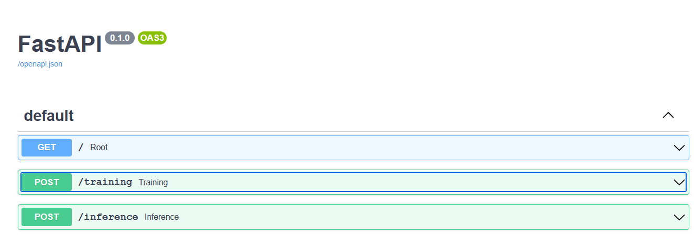

# Deploy-Simple-NLP-model-with-FastAPI
Deploying a simple NLP model of Word2Vec using FastAPI
+ **The goal of this project is not to build model but DEPLOYMENT using FastAPI**

## Project Structure
+ models 	- Contains the saved models generated during the process
+ notebooks 	- The notebooks used for creating the nlp models
+ main.py 	- The api routes
+ model.py	- The model training & inference class

## Data
+ The data has been taken from here - https://catalog.data.gov/dataset/consumer-complaint-database
+ We use a sample of 5000 records for our purpose as the data is quiet huge

## Steps for running
1. Run the "main.py" to start the api
2. Go to browser and type "http://localhost:8000/docs". You will the docs page of FastAPI come up from where we can easily test our API

3. Here you can select the route and click on "Try it out" to pass your parameter value
